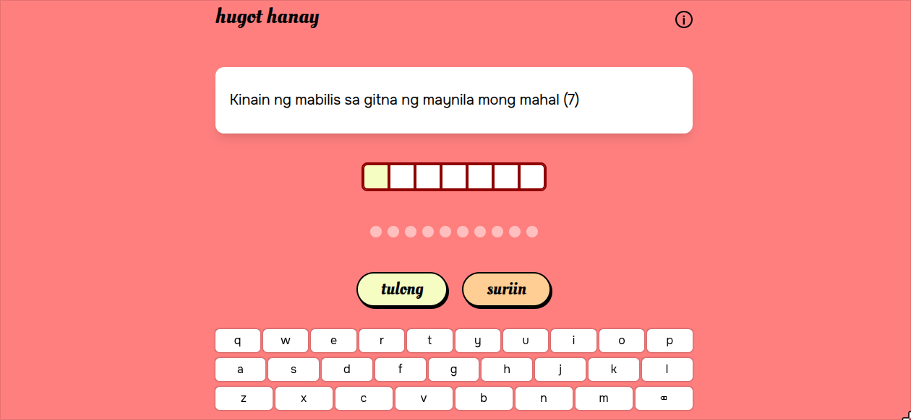

  
  
  

# Hugot Hanay

Hugot Hanay is a Filipino-language word puzzle game inspired by Minute Cryptic. The game was created for the initiative of disseminating use of Filipino, especially in scientific, academic, and specialized context. The game reimagines the minute cryptic's clue format in Filipino, blending wit, wordplay, and linguistic creativity to highlight that Filipino is not an inferior language, but a language of its own.

## Installation

Try out the website with this link:

    https://hugot-hanay.vercel.app

or, clone the repository

    git clone https://github.com/francogabrieloliveros/hugot-hanay.git

    npm install

    npm run dev

## Usage

### Home

In the home page, you would be greeted with **umpisahan** (start), **impormasyon** (about), and **May naisip na salitang palaisipan? Magsumite ng suhestiyon.** (submit suggestions). Clicking start would bring you to the game page. On the other hand, the about page shows information about the project, its authors, as well as a short tutorial for the game. Due to the game's scale, suggestions are also accepted — clicking submit suggestions would send you to an email page where you can send suggestions for additional puzzle questions that can be added in the game.

### Game Page

The first visible thing in the game page is the clue to what the word is. There are buttons **tulong** which shows clue options and **suriin** to check the answer. By clicking clue options, you can choose between showing the **indicator**, **source**, **definition**, or a **letter**. If all the available clues are exhausted, the level will be automatically finished and skipped. Finishing the level will bring you to the next random word. For more information, check out the [tutorial page](https://hugot-hanay.vercel.app/about).

## Additional Notes

- No english translations are present in the game as it was made for promoting use of Filipino language.
- The order of the words are picked at random, reloading the page will give you a different order of words.
- Currently, there are limited number of words in the database. Hence, similar words might be repeated in every random set.
- You can use a physical keyboard, or the keyboard in the page to input your answers.
